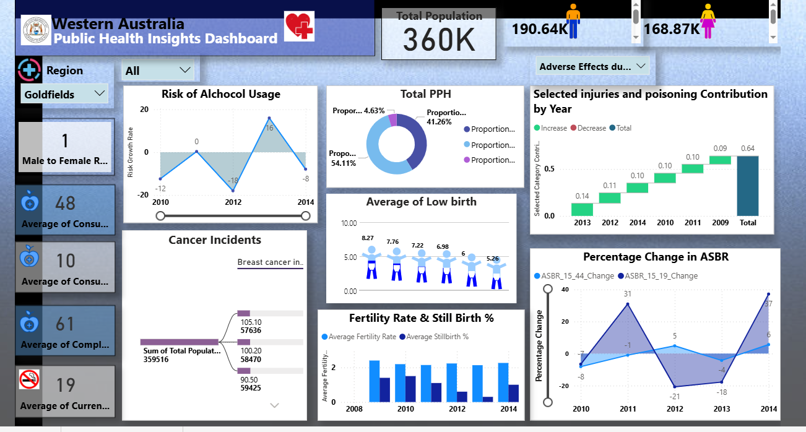

# 📊 Western Australia Public Health Insights Dashboard

## 🧠 Overview
The **Western Australia Public Health Insights Dashboard** is an interactive analytics project developed using **Microsoft SQL Server** and **Power BI**. It analyzes key public health indicators across Western Australia, focusing on trends from 2009–2014, including **alcohol consumption, cancer incidence, injury contributions, fertility rates, and maternal health**.

The dashboard transforms complex datasets into **interactive, actionable insights**, enabling evidence-based decision-making for **healthcare providers, researchers, and policymakers**. Data was sourced from [data.gov.au](https://www.data.gov.au/).

🔗 **View the live Power BI dashboard:** [Western Australia Public Health Insights Dashboard](https://app.powerbi.com/links/Z_ZDleXJW3?ctid=8f791105-7a87-467c-b4d4-b39c0ecb63c6&pbi_source=linkShare)

## 🎥 Dashboard Short Video
Click the preview image below to watch a short video demonstrating the interactive features of the Power BI dashboard, including slicers and dynamic visuals.

## 🌍 Real-World Significance
- Provides **data-driven insights** for public health planning and resource allocation  
- Identifies **regional disparities** in health outcomes and healthcare access  
- Supports interventions in **maternal and child health, chronic disease prevention, and injury reduction**  
- Demonstrates how **modern analytics tools** can improve healthcare decision-making  

## 🎯 Objectives
- Import, clean, and model public health data from SQL Server  
- Develop a **dynamic Power BI dashboard** with interactive visualizations  
- Analyze trends in **preventable hospitalizations, maternal health, cancer, alcohol-related harm, and injuries**  
- Enable policymakers to make **evidence-based decisions** for targeted interventions  

## 🛠️ Methodology
1. **Data Import:** Downloaded datasets from [data.gov.au](https://www.data.gov.au/) and inspected in Excel  
2. **Database Creation:** Imported datasets into SQL Server, creating the `health_1` database  
3. **Data Cleaning & Transformation:** Standardized column names, handled null values, removed unwanted characters, and converted data types  
4. **Power BI Integration:** Imported cleaned datasets into Power BI for visualization  
5. **Modeling & DAX:** Created advanced measures using DAX for dynamic calculations  
6. **Visualization & Dashboard:** Designed interactive charts, decomposition trees, and card visuals for clear insights  

## 📈 Dashboard Highlights
- **Potentially Preventable Hospitalizations (PPH):** acute, chronic, and vaccine-preventable conditions  
- **Low Birth Weight Trends:** urban vs. rural maternal health disparities  
- **Alcohol-Related Risk Trends:** regional year-over-year analysis  
- **Cancer Incidence:** decomposition tree for breast, lung, prostate, and colorectal cancers  
- **Fertility & Stillbirth Rates:** maternal health indicators  
- **Injury & Poisoning Contributions:** dynamic category analysis  
- **Age-Standardized Birth Rates (ASBR):** teen vs. general population trends  
- **Consumer Health Indicators:** fruit/vegetable intake, physical activity, smoking rates  
- **Population Demographics:** male/female ratio, total population distribution  

## 🔍 Key Insights
- Acute conditions dominate preventable hospitalizations; chronic conditions are significant  
- Rural areas show higher maternal and child health risks  
- Alcohol-related harms fluctuate with societal and policy factors  
- Cancer incidence varies by region and population density  
- Fertility and stillbirth rates remain stable, reflecting effective maternal care  
- Injuries and poisoning have declined due to successful public health initiatives  

## 🎛️ Interactivity
- **Region slicer:** filter data by geographic areas  
- **Year slicer:** analyze trends from 2009–2014  
- Fully dynamic visuals with drill-down capabilities  

## 🎓 Academic Context
- **Course:** SQL for Data Science (LB1224)  
- **Program:** BSc in Applied Data Science Communication  
- **University:** General Sir John Kotelawala Defence University  
- **Team Members:** D.P. Chami Sadunika, M.M.C.C. Marasinghe, E.S.R. Ruparathna, W.D.S.N. Kulasooriya  

## 🔑 Keywords
Public Health Analytics, SQL Server, Power BI, DAX, Data Visualization, Evidence-Based Decision Making, Maternal Health, Alcohol Risk, Cancer Analysis, Preventable Hospitalizations  

## 📄 Full Report
The complete academic report detailing **methodology, DAX calculations, visualizations, and recommendations** is included in this repository.
